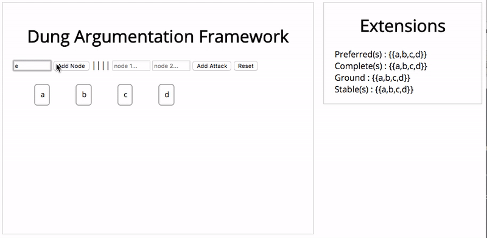

# Dung Argumentation Framework GUI

The sum of [dagre-d3](https://github.com/dagrejs/dagre-d3) and [heureka](https://github.com/nilsgeilen/heureka).

Find Preferred, Complete, stable and ground extensions of a given graph built in real time.





## Dependencies

- git
- gcc
- node with npm ```sudo apt-get install nodejs``` on Linux, ```brew install node``` on OSX
- bower (can be installed with npm : ```sudo npm install bower -g``` )
- eigen3 : ```sudo apt install libeigen3-dev``` on Linux, ```brew install eigen``` on OSX


## Installation


```
git clone https://github.com/ibaaj/DungArgumentationFrameworkGUI
bower install
npm install
git submodule add https://github.com/nilsgeilen/heureka
chmod +x ./heureka/build
```

If you are on OSX you need to change the include path, so edit the file ```./heureka/build``` and replace the line 3 with ```g++ --std=c++11 -O3 -I /usr/local/include/eigen3 -o heureka *.cpp``` instead of what it is written.

### Install heureka

```
./heureka/build
```

# Run

```
npm start
```

open your favorite browser and go to [http://localhost:3000](http://localhost:3000)
